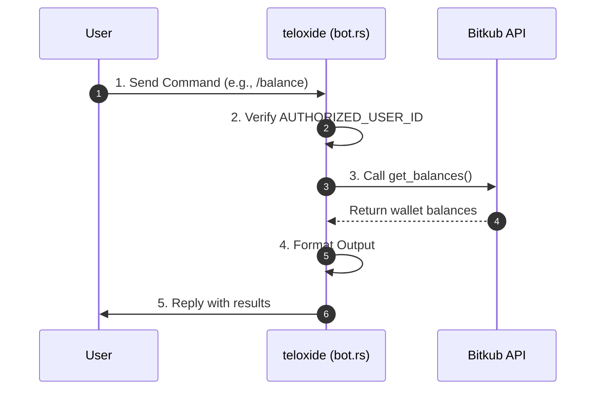

# Code Architecture & Documentation (`dca_btc`)

This document provides a technical overview of the `dca_btc` codebase, detailing the architecture, modules, and data flow.

## Architecture Overview

The `dca_btc` application is an asynchronous Rust project built to automate Bitcoin purchases on the Bitkub exchange and provide an interface via a Telegram bot.

### Core Technologies
- **Async Runtime:** `tokio`
- **Telegram Bot API:** `teloxide`
- **Database ORM/Query:** `sqlx` (PostgreSQL)
- **HTTP Client:** `reqwest` (for Bitkub API integration)
- **Task Scheduling:** `tokio_cron_scheduler`

---

## Module Breakdown

### `src/main.rs`
The entry point of the application.
- Loads environment variables using `dotenvy`.
- Initializes the PostgreSQL database connection pool via `db::init_pool`.
- Sets up the DCA (Dollar Cost Averaging) scheduler if `SCHEDULE_ENABLED` is `true`. It runs a cron job (using `tokio_cron_scheduler`) that executes `bitkub::process_buy_limit()`.
- Spawns the Telegram bot loop (`bot::run_bot`).

### `src/bot.rs`
Handles all Telegram bot interactions and command routing using `teloxide`.
- **`run_bot(pool: Arc<PgPool>)`**: The main bot loop. Checks if the incoming message is from the `AUTHORIZED_USER_ID`.
- **Command Handlers**:
  - `/buylimit <amount>`: Instantly places a limit order for the specified THB amount at the current market ask price.
  - `/balance`: Fetches THB and BTC balances from Bitkub and sends them to the user.
  - `/history <limit>`: Displays recent trade records from the database.
  - `/orderinfo`: Fetches the status of the last executed order from Bitkub.
  - `/status`: A simple health check to ensure the bot is responsive.
- **`wait_and_verify_order(...)`**: Spawns an async task after an order is placed to poll the Bitkub API. Once the order is filled, it updates the database and sends a Telegram alert with the exact filled amount.

### `src/bitkub.rs`
Contains all the logic for interacting with the Bitkub REST API. It handles authentication (signing requests with HMAC SHA-256) and API endpoint structures.
- **`process_buy_limit(pool: &PgPool, amount: f64)`**: The main business logic wrapper. Fetches the ticker price, places the limit buy order, and saves the initial trade to the database.
- **`place_bid_limit(amount: f64, rate: f64)`**: Places a specific limit buy order.
- **`get_ticker(sym: &str)`**: Fetches the current market ticker (e.g., to find the `lowest_ask` price).
- **`get_balances()`**: Retrieves the user's wallet balances.
- **`get_my_order_history(...)`**: Fetches the history of orders for a given symbol.
- **`get_order_info(...)`**: Fetches detailed information about a specific order ID (status, filled amount, fee).

### `src/db.rs`
The database abstraction layer using `sqlx`.
- **`init_pool()`**: Creates and returns the connection pool. Runs embedded migrations automatically.
- **`save_trade(...)`**: Inserts a new trade record when a buy order is initiated.
- **`update_trade_receive(...)`**: Updates the `receive_amount` (BTC acquired) once the order is filled and verified.
- **`get_latest_trade()` & `get_trade_by_order_id()`**: Utility queries for retrieving historical trades.

### `src/models.rs`
Contains all the Rust structs used for database schemas and JSON serialization/deserialization.
- **`Trade`**: Represents a database record of a trade.
- **`TickerData`**: Parses the response from the `/api/market/ticker` endpoint.
- **`OrderInfoResult`**: Parses the detailed order information response.

---

## Core Workflows

### 1. Scheduled Auto-Buy (DCA)

```mermaid
sequenceDiagram
    autonumber
    participant Cron as tokio_cron_scheduler
    participant Bot as bitkub::process_buy_limit
    participant API as Bitkub API
    participant DB as Postgres (sqlx)
    participant TG as Telegram
    
    Cron->>Bot: 1. Trigger Scheduled Buy
    Bot->>API: 2. get_ticker (Fetch lowest_ask)
    API-->>Bot: Return current price
    Bot->>API: 3. place_bid_limit (amount, rate)
    API-->>Bot: Order response (order_id)
    Bot->>DB: 4. save_trade (Log pending order)
    Bot->>Bot: 5. Spawn wait_and_verify_order
    
    rect rgb(30, 30, 30)
        note right of Bot: Background Verification Loop
        loop Poll Status
            Bot->>API: get_order_info(order_id)
            API-->>Bot: return status
        end
    end
    
    Bot->>DB: 6. update_trade_receive (Log actual BTC received)
    Bot->>TG: 7. send_alert (Send Success Message)
```

### 2. Manual Telegram Commands

